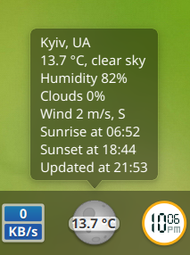
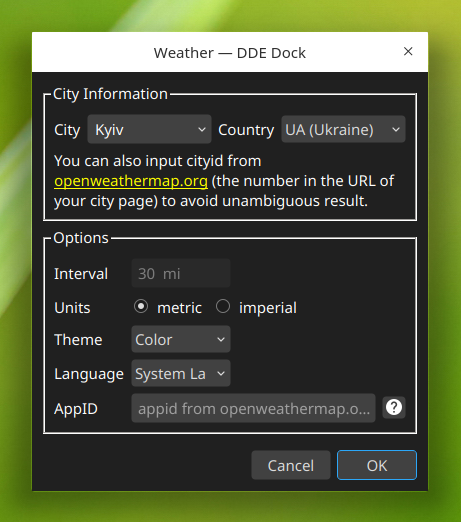

Deepin dock weather plugin 
==========================

This is a weather plugin for deepin-dock, with API from [openweathermap](https://openweathermap.org).





### Installation Guide ###
Compiling using Qt Creator or using the following command:
```
mkdir build
cd build
qmake ../source
make
```

Install:
```
sudo make install
```

and restart deepin dock:
```
killall dde-dock
```
### Acknowledgment ###
This Plugin was initially inspired by [sonichy's weather plugin](https://github.com/sonichy/WEATHER_DDE_DOCK) and by [CareF neoweather plugin](https://github.com/CareF/deepin-dock-plugin-neoweather).
